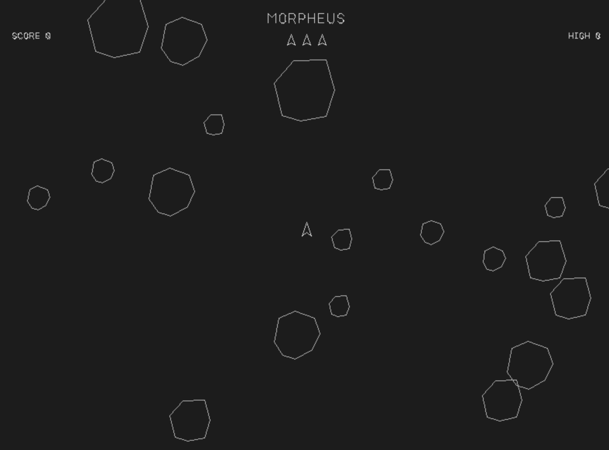

# Morpheus

A modern implementation of the classic **Atari Asteroids** arcade game, built with C++ and SDL3. Destroy asteroids, dodge collisions, and survive as long as you can!



## About

Morpheus is a faithful recreation of the legendary 1979 Atari Asteroids arcade game. Navigate your spaceship through a dangerous asteroid field, break down larger asteroids into smaller pieces, and accumulate points without losing all your lives.

## Game Features

- **Classic Arcade Gameplay** - Rotate, thrust, and shoot to destroy asteroids
- **Progressive Difficulty** - More asteroids spawn as you clear the screen
- **Score Tracking** - Track your current score and high score
- **Lives System** - Start with 3 lives; lose one when colliding with an asteroid
- **Ship Explosion Animation** - Dramatic 2+ second explosion animation when destroyed
- **Safe Spawn System** - Intelligent respawn logic prevents unfair instant collisions
- **Pixel-Perfect Collision Detection** - Collisions occur when objects actually touch

## Prerequisites

### macOS
```bash
brew install sdl3
```

### Ubuntu/Debian
```bash
sudo apt-get install libsdl3-dev
```

### Windows
1. Download **SDL3-devel-3.x.x-VC.zip** (Visual C++ development libraries) from [SDL3 Releases](https://github.com/libsdl-org/SDL/releases)
2. Extract the downloaded ZIP file
3. Create a `libs` folder in the project root directory (if it doesn't exist)
4. Copy the entire SDL3 folder into `libs` so that you have the following structure:
   ```
   Morpheus/
   ├── libs/
   │   └── SDL3/
   │       ├── include/
   │       │   └── SDL3/
   │       │       ├── SDL.h
   │       │       └── ...
   │       └── lib/
   │           └── x64/
   │               ├── SDL3.dll
   │               └── SDL3.lib
   ├── src/
   ├── include/
   └── CMakeLists.txt
   ```
5. **Note**: Make sure to use the `x64` version if you're building for 64-bit (recommended)

## Building

### Windows (Visual Studio)
```powershell
mkdir build
cd build
cmake ..
cmake --build . --config Release
```

### macOS / Linux
```bash
mkdir -p build
cd build
cmake ..
cmake --build .
```

## Running

### Windows
```powershell
# From the build directory
.\Release\Morpheus.exe

# Or navigate to the Release folder
cd Release
.\Morpheus.exe
```

### macOS / Linux
```bash
./Morpheus
```

## Controls

- **LEFT ARROW** - Rotate ship counterclockwise
- **RIGHT ARROW** - Rotate ship clockwise
- **UP ARROW** - Thrust (accelerate forward)
- **SPACE** - Shoot (coming soon)
- **ESC** - Exit game

## Gameplay

### Objective
Destroy all asteroids on the screen to advance to the next level. Each destroyed asteroid breaks into smaller pieces (except the smallest ones, which are destroyed completely).

### Scoring
- Small asteroid: 100 points
- Medium asteroid: 50 points
- Large asteroid: 20 points

### Game Over
The game ends when you lose all 3 lives. Your final score is compared to the high score.

### Special Features
- **Safe Spawn Zones** - When you respawn after losing a life, the game waits for the center of the screen to be clear of asteroids
- **Initial Deployment** - At game start, asteroids are guaranteed to not overlap, ensuring a fair beginning
- **Respawn Messages** - Visual feedback while waiting for safe spawn positions:
  - "WAIT FOR SAFE DEPLOYMENT" - When waiting for the initial safe zone
  - "WAITING TO SAFELY RESPAWN" - When waiting after losing a life

## Building from Source

### Requirements
- C++17 or later
- CMake 3.15 or later
- SDL3 (see Prerequisites section above)

### Windows

1. Clone the repository:
```powershell
git clone https://github.com/guildenstern70/Morpheus
cd Morpheus
```

2. Set up SDL3 (see Windows Prerequisites section above)

3. Create and navigate to build directory:
```powershell
mkdir build
cd build
```

4. Configure with CMake:
```powershell
cmake ..
```

5. Build the project:
```powershell
cmake --build . --config Release
```

6. Run the game:
```powershell
cd Release
.\Morpheus.exe
```

### macOS / Linux

1. Clone the repository:
```bash
git clone https://github.com/guildenstern70/Morpheus
cd Morpheus
```

2. Install SDL3 (see Prerequisites section above)

3. Create and navigate to build directory:
```bash
mkdir -p build
cd build
```

4. Configure and build:
```bash
cmake ..
cmake --build .
```

5. Run the game:
```bash
./Morpheus
```

## Project Structure

```
Morpheus/
├── src/              # Source files
│   ├── main.cpp      # Game loop and main logic
│   ├── Game.cpp      # Game state and collision logic
│   ├── Ship.cpp      # Ship implementation
│   ├── Asteroid.cpp  # Asteroid implementation
│   ├── ShipExplosion.cpp
│   └── TextRenderer.cpp
├── include/          # Header files
├── assets/           # Game assets (sprites, sounds, fonts)
├── CMakeLists.txt    # Build configuration
└── README.md         # This file
```

## License

This project is licensed under the MIT License. See the LICENSE file for details.

## Copyright

Project Morpheus © 2026 Alessio Saltarin

---

*Morpheus is inspired by the classic Atari Asteroids arcade game, one of the most iconic games in video game history.*


